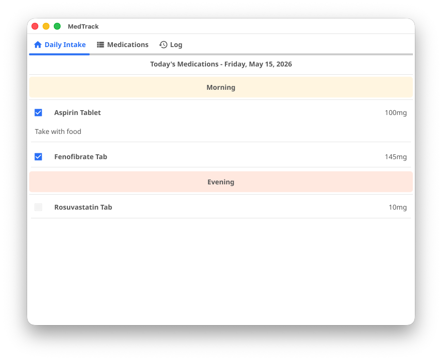
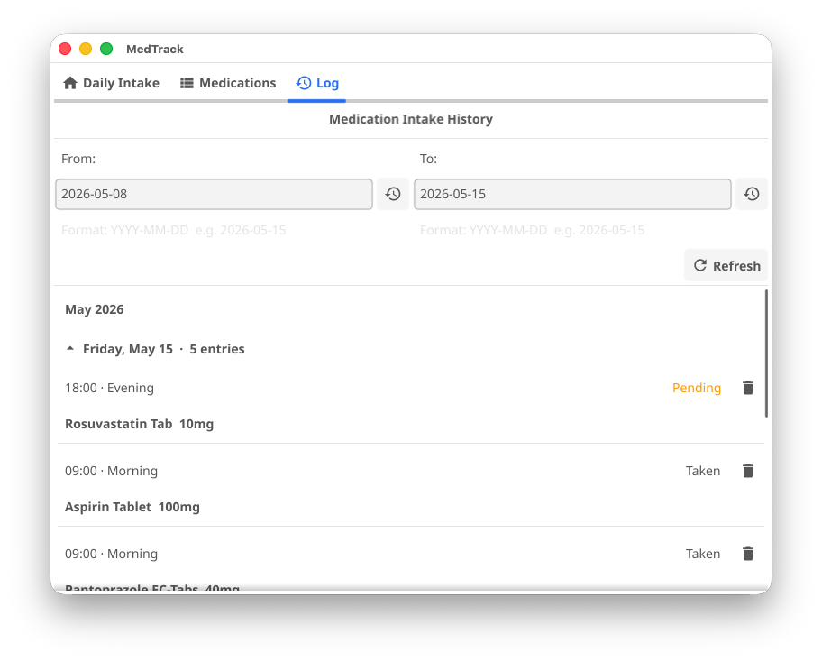
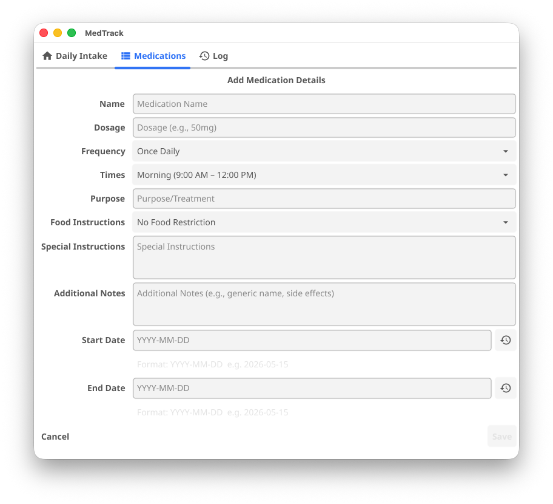

# MedTrack

A desktop application for managing medication schedules and tracking daily intake. Built with Go and Fyne v2 for MacOS, Linux and Windows.


---

## Overview

MedTrack lets you maintain a medication list, view a daily schedule grouped by time of day, mark doses as taken, and review a historical log with date-range filtering. Data is stored locally in a SQLite database — no network connection required.

---

## Screenshots

#### Daily Intake

*Daily medication schedule grouped by morning, afternoon, evening, and bedtime*

#### Medication Management

*Medication cards with dosage, timing, and instructions*

#### Add / Edit Medication

*Form for adding and editing medication details*

---

## Features

- **Medication management** — add, edit, and soft-delete medications with name, dosage, frequency, food instructions, special instructions, notes, and start/end dates
- **Active/Inactive toggle** — pause a medication with the Active checkbox to exclude it from Daily Intake without deleting it; pending intakes are removed, taken entries are preserved
- **Flexible scheduling** — once, twice, three times, or four times daily; bedtime slot (10 PM); or *As Needed* (PRN) for on-demand medications
- **Daily intake view** — doses grouped into Morning / Afternoon / Evening / Bedtime sections; PRN medications shown separately with a "Record Use" button
- **Smart taken-at recording** — if a dose is marked within 2 hours of its scheduled time, the scheduled time is recorded; otherwise the actual clock time is used
- **Schedule-change reconciliation** — editing a medication's schedule immediately removes pending intakes for dropped slots and creates pending intakes for new slots; taken entries are never affected
- **Medication log** — historical intake records with date-range filter, grouped by month and date (newest first), with per-entry delete
- **Data management** — clear intake history or reset all data via Preferences (two-step confirmation required)

---

## Prerequisites

- **Go 1.23+**
- **macOS** (primary platform; Fyne supports Linux and Windows but these are untested)
- **Xcode Command Line Tools** — required for CGO (`go-sqlite3` is a CGO package)
  ```bash
  xcode-select --install
  ```
- **gcc and pkg-config** via Homebrew:
  ```bash
  brew install gcc pkg-config
  ```
- **make** — pre-installed on macOS via Xcode Command Line Tools
- **fyne CLI** (for packaging and install targets):
  ```bash
  make tools
  ```

---

## Installation

### Option 1 — Quick install (end users)

```bash
go install github.com/ashprao/medtrack/cmd/medtrack@v1.2.0
```

The binary is installed to `$GOPATH/bin` (or `~/go/bin` if `GOPATH` is not set). Ensure that directory is on your `$PATH`.

### Option 2 — Build from source (developers)

```bash
git clone https://github.com/ashprao/medtrack.git
cd medtrack
make tools   # install fyne and fyne-cross CLIs (first time only)
make build   # compile → build/MedTrack
make run     # build and launch
```

Or without make:

```bash
go build -o MedTrack ./cmd/medtrack
./MedTrack
```

### Option 3 — Install as a macOS app bundle

```bash
make install  # packages and copies MedTrack.app to /Applications
```

---

## Build & Packaging

All common tasks are covered by the `Makefile`. Run `make` (or `make help`) to see all targets.

### Development

| Command | Description |
|---------|-------------|
| `make build` | Compile native binary → `build/MedTrack` |
| `make test` | Run all tests (`CGO_ENABLED=1 go test ./...`) |
| `make run` | Build and launch the app |
| `make clean` | Remove all build artifacts |

### macOS Packaging

| Command | Description |
|---------|-------------|
| `make package` | Create `MedTrack.app` bundle (debug build) |
| `make package-release` | Create `MedTrack.app` with debug symbols stripped |
| `make install` | Package and copy to `/Applications` |
| `make dmg` | Release app + ad-hoc sign + wrap into `MedTrack-<version>.dmg` |
| `make dmg-signed` | Release app + Developer ID sign + wrap + sign DMG |

### Code Signing

| Command | Description |
|---------|-------------|
| `make sign-adhoc` | Ad-hoc sign `MedTrack.app` (runs on your Mac only, no Apple account needed) |
| `make sign` | Developer ID sign (requires `DEVELOPER_ID` env var) |

For distribution to other Macs, set your certificate before running `make dmg-signed`:

```bash
export DEVELOPER_ID="Developer ID Application: Your Name (TEAMID)"
make dmg-signed
```

### Notarization (Apple distribution)

Required for internet distribution without Gatekeeper warnings (macOS 10.15+):

```bash
export DEVELOPER_ID="Developer ID Application: Your Name (TEAMID)"
export APPLE_ID="you@example.com"
export APP_PASSWORD="xxxx-xxxx-xxxx-xxxx"  # app-specific password
export TEAM_ID="YOURTEAMID"
make release-signed   # version check + sign + DMG + notarize + staple
```

### Cross-platform

| Command | Description |
|---------|-------------|
| `make dist` | Build darwin/amd64 + darwin/arm64 via `fyne-cross` → `fyne-cross/dist/` |
| `make tools` | Install `fyne` and `fyne-cross` CLIs to `$GOPATH/bin` |

---

## Usage

| Tab | Purpose |
|-----|---------|
| **Daily Intake** | View today's doses grouped by time of day; check doses off as taken; record PRN doses |
| **Medications** | Add, edit, or delete medications |
| **Log** | Review historical intake records; set a date range and refresh |
| **Help** | In-app usage guidance |

The **app menu** (macOS) exposes **About** and **Preferences** (data management).

---

## Project Structure

```
medtrack/
├── cmd/
│   └── medtrack/
│       ├── main.go          # Entry point; owns db.Manager; wires views via closures
│       └── FyneApp.toml     # Bundle ID, version, icon metadata (read by fyne CLI)
├── internal/
│   ├── db/
│   │   ├── database.go      # SQLite manager; schema creation; all DB methods
│   │   └── database_test.go
│   ├── models/
│   │   ├── medication.go    # Medication struct; ParseFrequency
│   │   ├── medication_test.go
│   │   ├── intake.go        # Intake struct; IntakeStatus constants
│   │   └── intake_test.go
│   └── ui/
│       ├── theme/           # Custom Fyne theme (if any)
│       └── views/
│           ├── daily_intake.go      # Daily schedule view
│           ├── medication_list.go   # Medication list + inline form
│           ├── medication_form.go   # Add/edit form component
│           ├── medication_log.go    # Historical log view
│           ├── preferences.go       # Preferences window
│           ├── about.go             # About dialog
│           └── help.go              # Help view
├── docs/
│   ├── architecture.md      # Technical architecture reference
│   └── ai-experiment.md     # Historical: how this project was created
├── Icon.png                 # App icon (512×512 PNG; auto-converted to .icns by fyne)
├── Makefile                 # Build, package, sign, DMG, notarize targets
├── go.mod
└── CHANGELOG.md
```

For a detailed walkthrough of the architecture, data flow, and key design decisions, see [docs/architecture.md](docs/architecture.md).

---

## Running Tests

```bash
make test
```

Or directly:

```bash
CGO_ENABLED=1 go test ./...
```

CGO is required (SQLite). All tests use a temporary on-disk database created via `os.CreateTemp`.

---

## Contributing

1. Fork the repository
2. Create a feature branch (`git checkout -b feature/my-feature`)
3. Add tests for new behaviour
4. Ensure `make test` passes and `make build` is clean
5. Submit a pull request

Please read [docs/architecture.md](docs/architecture.md) before making structural changes — the push-based data flow and view wiring conventions are intentional.

---

## Version History

See [CHANGELOG.md](CHANGELOG.md) for full details.

| Version | Date | Summary |
|---------|------|---------|
| v1.1.0 | May 2026 | PRN medications, smart taken-at recording, log layout refactor, bedtime scheduling, soft-delete |
| v0.2.0 | March 2025 | Medication log with date filtering |
| v0.1.0 | February 2025 | Initial release |

---

## License

MIT — see [LICENSE](LICENSE) for details.

---

*This project originated as an AI pair programming experiment. See [docs/ai-experiment.md](docs/ai-experiment.md) for that story.*
