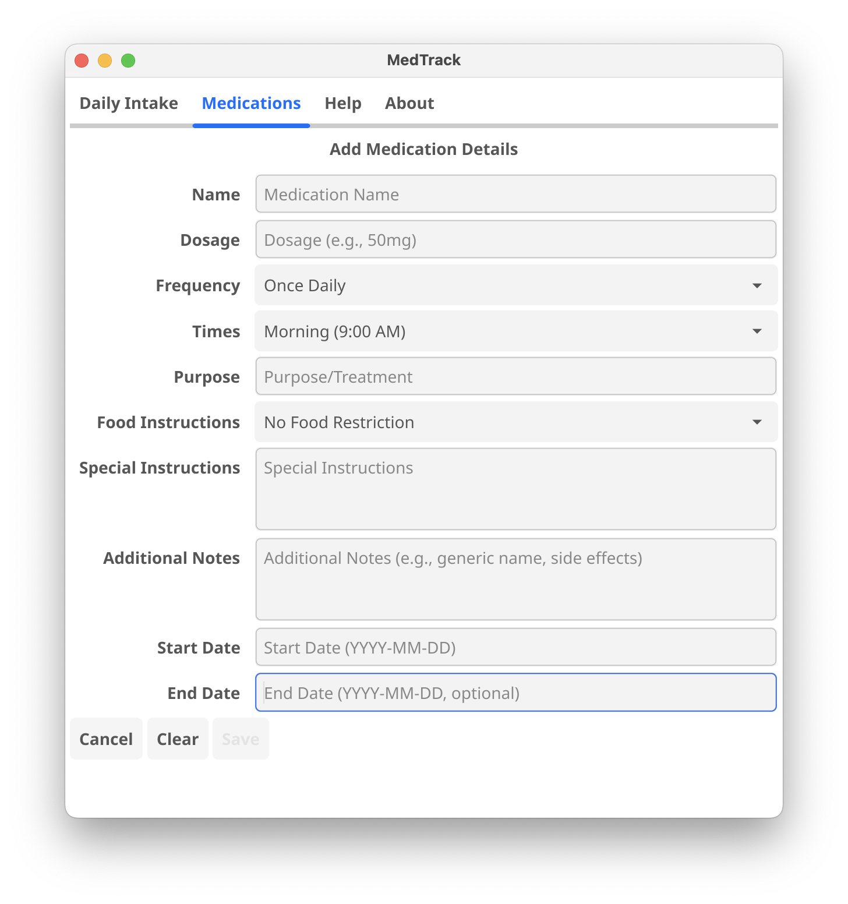

# MedTrack: An AI Pair Programming Experiment

## Quick Install
```bash
go install github.com/ashprao/medtrack/cmd/medtrack@v0.1.0
```
This will install the latest stable version of MedTrack to your $GOPATH/bin directory (or $HOME/go/bin if GOPATH isn't set).

## The Experiment

This project represents a unique experiment in AI pair programming, where I built a complete medication tracking application without writing a single line of code manually. Every aspect of development was handled through natural language interaction with Claude (claude-3.5-sonnet) via the Cline extension in VSCode.

### The Goal
Could we create a fully functional, production-quality application solely through AI programming? I chose Go and Fyne UI as the foundation, and let the AI handle everything else - from suggesting SQLite for storage to implementing a clean MVC architecture.

### Key Findings

🌟 **What Worked Well**
1. **Complete Automation**
   - AI suggested architectural patterns
   - Cline handled all file operations
   - Automated testing and debugging
   - Generated comprehensive documentation

2. **Sophisticated Debugging**
   - When the medication listing broke, Claude showed impressive adaptability
   - Evolved from static code analysis to strategic logging
   - Successfully diagnosed and fixed complex issues

⚠️ **Critical Challenges**
The most significant insight came from UI state management issues:
- Forms would break 3-4 times during development
- Each regression triggered multiple AI fix attempts
- While initial development was lightning fast...
- Repeated fixes consumed significant credits
- Time savings were partially offset by regression cycles

This revealed a crucial trade-off: AI's rapid initial development can be offset by recurring issues and credit consumption from repeated fix attempts.

### Development Journey
For a deep dive into the AI pair programming experience, including detailed insights into the challenges, successes, and lessons learned, see the [Development Journey](docs/development-journey.md) documentation.

---

## The Application

MedTrack is a desktop application for managing medication schedules and tracking daily intake, demonstrating what's possible with AI-driven development.

### Screenshots

#### Medication Management

*Main view showing medication cards with dosage, timing, and instructions*

#### Daily Intake Tracking

*Daily medication schedule grouped by morning, afternoon, and night*

#### Medication Form

*Comprehensive form for adding and editing medication details*

### Core Features

- **Medication Management**
  - Add and edit medications with detailed information
  - Track dosage, frequency, and timing
  - Record food-related instructions
  - Store special instructions and notes
  - Set start and end dates

- **Daily Intake Tracking**
  - View medications organized by time of day
  - Track medication intake with checkboxes
  - See food instructions prominently
  - Group medications by morning, afternoon, and night

- **User Interface**
  - Clean, intuitive interface
  - Mobile-friendly design
  - Cross-platform support
  - Responsive layout

### Installation

There are two ways to install MedTrack:

#### Option 1: Quick Install (Recommended for Users)
```bash
go install github.com/ashprao/medtrack/cmd/medtrack@v0.1.0
```
This will install the MedTrack binary to your $GOPATH/bin directory.

#### Option 2: Build from Source (For Developers)
1. Ensure Go 1.23+ installed
2. Install Fyne dependencies:
   ```bash
   # macOS
   brew install golang gcc pkg-config
   ```
3. Clone and run:
   ```bash
   git clone https://github.com/ashprao/medtrack.git
   cd medtrack
   go mod download
   go run cmd/medtrack/main.go
   ```

### Version History

For detailed changes, see [CHANGELOG.md](CHANGELOG.md)

#### Latest Release
- **v0.1.0** (February 2025): Initial release with core medication tracking functionality, daily intake monitoring, and cross-platform GUI.

### Project Structure

```
medtrack/
├── cmd/medtrack/          # Application entry
├── internal/
│   ├── db/               # Database management
│   ├── models/           # Core data models
│   └── ui/
│       ├── theme/        # UI customization
│       └── views/        # UI components
└── docs/                 # Documentation
```

### Basic Usage

1. **Adding Medications**
   - Click "Add New Medication"
   - Fill in details (name, dosage, timing)
   - Add instructions and notes
   - Save to return to list

2. **Tracking Daily Intake**
   - Switch to Daily Intake tab
   - View medications by time
   - Check off as taken
   - View instructions as needed

### Development

- Built with Go and Fyne UI toolkit
- SQLite for local storage
- MVC-like architecture
- Mobile-first design
- Cross-platform support

### Contributing

Contributions welcome! Please:
1. Fork the repository
2. Create a feature branch
3. Add tests for new features
4. Update documentation
5. Submit a Pull Request

### License

MIT License - see [LICENSE](LICENSE) for details.

---

## Looking Forward

While this experiment proved AI-only development is possible, it highlighted both potential and limitations. Success requires smart decisions about when to let AI iterate versus stepping in manually. The future of development might look like this - but with better handling of UI state and more refined AI interaction strategies.
